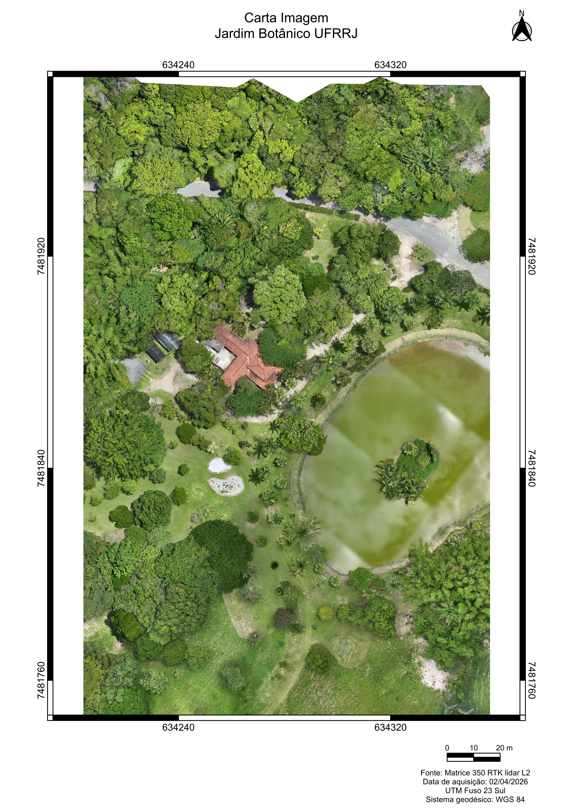
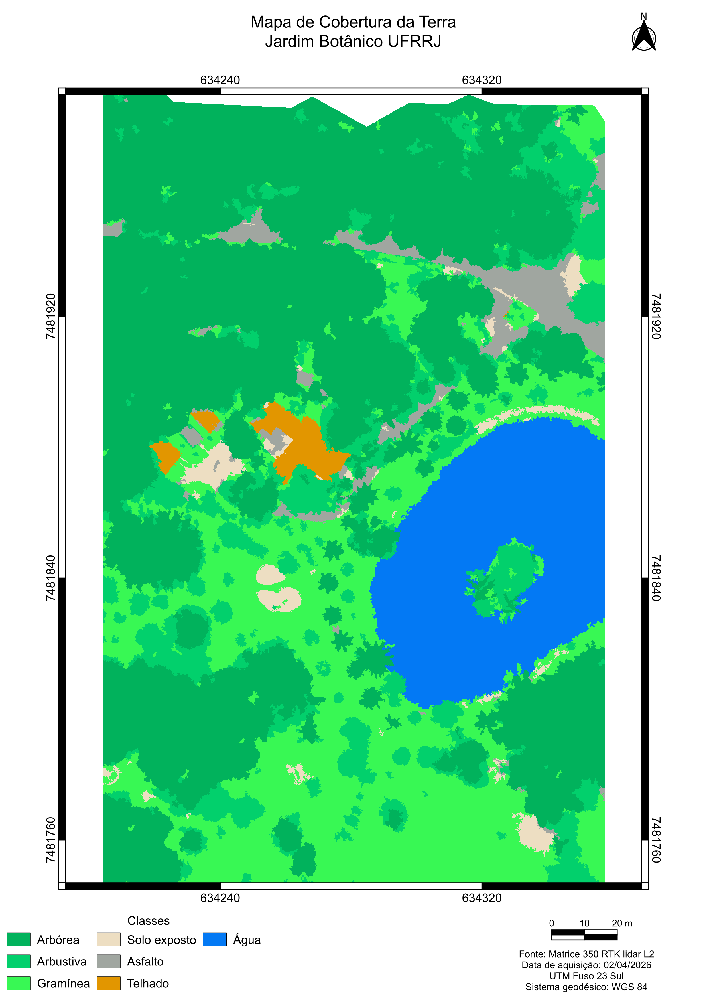
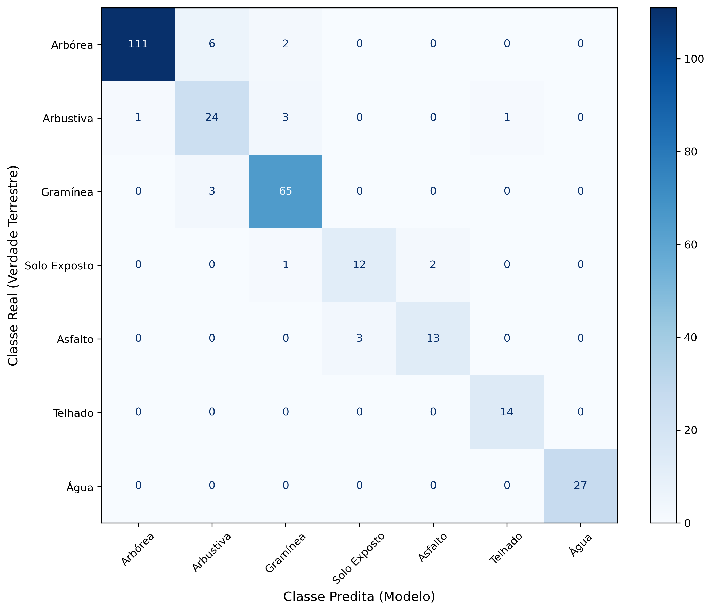

# Classificação LULC com GEOBIA, LiDAR e Random Forest

Pipeline automatizado em Python para classificação do Uso e Cobertura da Terra (LULC) integrando dados ópticos de alta resolução (ortofoto RGB) e dados estruturais tridimensionais (LiDAR aerotransportado) através de Análise de Imagens Baseada em Objetos Geográficos (GEOBIA).

> **Área de Estudo:** Setor CLOUD7 — Jardim Botânico da UFRRJ (Seropédica/RJ)  
> **Sensor:** DJI Zenmuse L2 embarcado em ARP DJI Matrice 350 RTK  
> **Acurácia Global:** 92,38% | **Índice Kappa:** 0,911

---

# Visão Geral do Projeto

A classificação da cobertura da terra em zonas de transição urbano-vegetal sofre com ambiguidades espectrais no pixel-a-pixel tradicional (ex.: confusão entre copas de árvores e gramíneas, ou asfalto e corpos d'água). 

Este projeto resolve essa limitação adotando:
1. **GEOBIA (Mean-Shift via Orfeo ToolBox):** Segmentação da ortofoto em superpixels para respeitar o contexto espacial.
2. **Fusão Multissensor:** Atributos tridimensionais de dossel (CHM), microrrelevo (TRI, TPI) e refletância ativa (Intensidade LiDAR) combinados a índices espectrais ópticos (VARI, NGBDI) e métricas de forma (circularidade).
3. **Random Forest com Filtro Físico:** Aprendizado supervisionado balanceado associado a regras de pós-classificação altimétrica (remoção de falsos positivos em telhados).

---

# Resultados e Visualização

 

 

## Fluxo de Execução do Pipeline (`lulc.py`)

O módulo foi estruturado em funções sequenciais e independentes:

1. **`propriedades(...)`**  
   Extrai as estatísticas zonais de todos os rasters para o vetor de superpixels, gerando o GeoPackage enriquecido.
2. **`rf1(...)`**  
   Cruza as amostras de treino, ajusta o `RandomForestClassifier`, avalia a incerteza espacial (`predict_proba`), aplica o filtro físico altimétrico e gera o vetor final classificado.
3. **`vetor_tif(...)`**  
   Converte o resultado vetorial em raster GeoTIFF alinhado geometricamente com a grade original do LiDAR (CHM).
4. **`estatisticas(...)`**  
   Gera o relatório de auditoria e métricas (Precision, Recall, F1-Score, Kappa) em Excel e plota a matriz de confusão.
5. **`calcular_areas_finais(...)`**  
   Calcula a área planimétrica (m² e hectares) e o percentual de ocupação territorial de cada macroclasse no mapa final.

---
